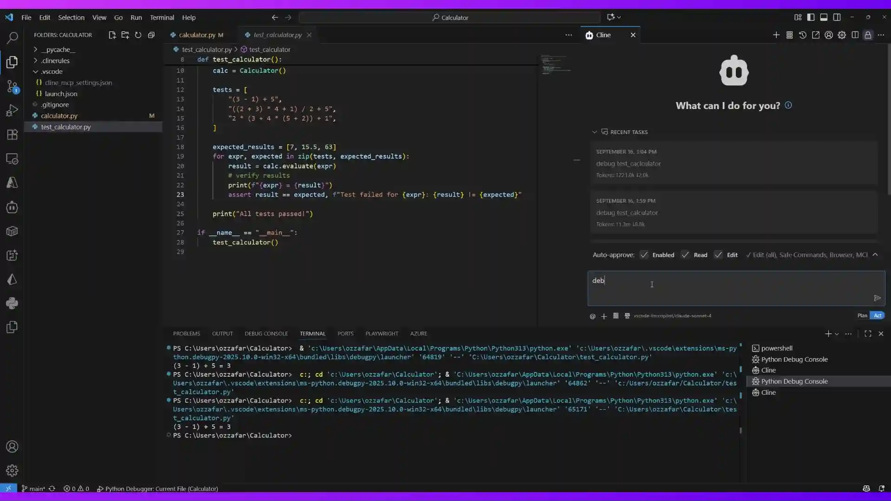

# CMSIS Developer Assistant — AI-Driven Debugging for Arm Cortex-M Targets

CMSIS Developer Assistant is an MCP server that lets an AI agent drive the VS Code debugger against Arm Cortex-M targets through the **CMSIS Debugger** extension — setting breakpoints, stepping, reading memory and core registers, decoding fault status, and inspecting peripheral registers via SVD. It also supports general multi-language debugging (Python, JavaScript/TypeScript, Java, C#, C++, Go, Rust, PHP, Ruby).

Works with **GitHub Copilot**, **Claude Code**, **Claude Desktop**, **Cline**, **Cursor**, and any MCP-compatible assistant.

> Originally derived from [microsoft/DebugMCP](https://github.com/microsoft/DebugMCP) (MIT), now developed independently by Arm as part of the Open-CMSIS-Pack project. See [CHANGELOG.md](CHANGELOG.md) for the embedded-specific additions.

[](#license)
[](https://code.visualstudio.com/)
[](https://github.com/Open-CMSIS-Pack/CMSIS-Developer-Assistant/releases)

<p align="center">
  
</p>

## Table of Contents

- [Overview](#overview)
- [Features](#features)
- [Installation](#installation)
- [Quick Start — CMSIS Target](#quick-start--cmsis-target)
- [Quick Start — General Languages](#quick-start--general-languages)
- [Supported Languages & Targets](#supported-languages--targets)
- [Configuration](#configuration)
- [FAQ](#faq)
- [Troubleshooting](#troubleshooting)
- [How It Works](#how-it-works)
- [Requirements](#requirements)
- [Development](#development)
- [Contributing](#contributing)
- [Security](#security)
- [License](#license)

## Overview

CMSIS Developer Assistant is an MCP server that gives AI coding agents full control over the VS Code debugger. For embedded Arm Cortex-M development it delegates to the **CMSIS Debugger** extension (`arm.vscode-cmsis-debugger`) via `gdbtarget` launch configurations produced by CMSIS Solution, driving pyOCD or J-Link GDB Server against real hardware such as the Alif Semiconductor AppKit. It also supports general multi-language debugging. It runs 100% locally, requires no credentials, and works out of the box with any MCP-compatible AI assistant.

## Features

> Every hardware-touching tool accepts an optional **`timeoutMs`** parameter (server-capped to 60 000 ms). Handler-level deadlines guarantee no MCP call hangs the agent — see *Operational guarantees* below.

### ⭐ CMSIS Solution control (preferred for embedded)

| Tool | Description | Parameters |
|------|-------------|------------|
| **cmsis_action** | Wrap the buttons in the CMSIS Solution panel. ⭐ Preferred entry point for Cortex-M debug — `load_and_debug` builds (if needed), flashes the device, and attaches in one step. | `action` (`build` / `load` / `erase` / `load_and_run` / `load_and_debug` / `attach` / `detach` / `stop_run`)<br>`timeoutMs` (optional) |

### 🔧 Core Debug Tools

| Tool | Description | Parameters |
|------|-------------|------------|
| **get_debug_instructions** | Get the debugging guide with best practices, target-awareness checklist, session-status decision table, and root-cause framework | None |
| **start_debugging** | Start a debug session (non-CMSIS targets — Python/Java/JS/etc.). For CMSIS use `cmsis_action load_and_debug` instead. Refuses if a session is already active. | `configurationName` (optional)<br>`fileFullPath` (optional)<br>`workingDirectory` (optional)<br>`testName` (optional)<br>`timeoutMs` (optional) |
| **stop_debugging** | Stop the current debug session | None |
| **restart_debugging** | Restart the current debug session and wait for it to become ready | `timeoutMs` (optional) |
| **pause_execution** | DAP `pause` — halt a running target without ending the session. No-op if already stopped. | `timeoutMs` (optional) |
| **step_over** / **step_into** / **step_out** | Step. Auto-heals on timeout: pauses the running target, reads PC + frame, reports where the firmware actually was. | `timeoutMs` (optional) |
| **continue_execution** | Resume execution. Same auto-heal-on-timeout behavior. | `timeoutMs` (optional) |
| **wait_for_stop** | Block until the target next stops (breakpoint, fault, step, pause) and return the stop reason + state, or a structured timeout. Replaces blind sleeping after an async continue. Issues no execution commands itself. | `timeoutMs` (optional) |
| **add_breakpoint** | Add a breakpoint at a 1-based line, optionally conditional. The condition becomes GDB's native `if`, so the core is only halted when it holds. State-aware hint when the session is running. | `fileFullPath`<br>`line`<br>`condition` (optional)<br>`lineContent` (deprecated) |
| **add_logpoint** | Print a message and resume instead of halting, via GDB `dprintf`. `{expr}` interpolates as `%d`; `{expr:%s}` overrides the specifier. Note: the core still halts per hit to print. | `fileFullPath`<br>`line`<br>`logMessage`<br>`condition` (optional) |
| **remove_breakpoint** | Remove a breakpoint | `fileFullPath`<br>`line` |
| **clear_all_breakpoints** / **list_breakpoints** | Breakpoint set management | None |
| **list_variable_names** | Names and types in scope, reading no values. Discover first, then read only what you need. | `scope` (optional)<br>`timeoutMs` (optional) |
| **get_variables_values** | Variables at the active frame. Omit `variableNames` for the whole scope, or name up to 50 to read just those. | `scope` (`local` / `global` / `all`)<br>`variableNames` (optional)<br>`timeoutMs` (optional) |
| **evaluate_expression** | Evaluate an expression in the current frame | `expression`<br>`timeoutMs` (optional) |
| **get_call_stack** | Full DAP stackTrace with `frameId` per frame | `threadId` (optional)<br>`levels` (optional, ≤200)<br>`timeoutMs` (optional) |
| **get_threads** | DAP threads enumeration. With RTOS-aware GDB servers (pyOCD `--rtos`, J-Link plugin) returns FreeRTOS / RTX / ThreadX tasks. | `timeoutMs` (optional) |
| **get_frame_variables** | Inspect variables at an explicit `frameId` without changing the active editor frame | `frameId`<br>`scope` (optional)<br>`variableNames` (optional)<br>`timeoutMs` (optional) |
| **list_debug_windows** / **select_debug_window** | Show the VS Code windows the server can drive, and pin one for this session. Registered only when routing. | `pid` or `workspaceFolder` |

### 🧠 Embedded / Cortex-M Tools

| Tool | Description | Parameters |
|------|-------------|------------|
| **read_memory** | Read a range of bytes from the target. DAP `readMemory` with multi-strategy GDB fallback. | `address` (hex)<br>`length` (1-4096)<br>`format` (`hex` / `ascii` / `both`)<br>`timeoutMs` (optional) |
| **read_core_registers** | Read Cortex-M core registers (R0–R15, xPSR, MSP, PSP, CONTROL, FAULTMASK, BASEPRI, PRIMASK). Parallel evaluates with overall and per-request deadlines. | `timeoutMs` (optional) |
| **read_cycle_counter** | DWT cycle counter (CYCCNT) for cycle-accurate timing between two stops. Enables trace + counter on first use; reports NOCYCCNT cores honestly; documents the 2³² wrap and halt/WFE stalls. | `timeoutMs` (optional) |
| **reset** | Reset the target inside the live session (breakpoints survive) and VERIFY the reset took effect — PC is compared against the reset vector. Method selection (`auto`/`system`/`core`/`hardware`); honest "did NOT reset" reporting. | `method` (optional)<br>`halt` (optional)<br>`timeoutMs` (optional) |
| **flash** | Program target flash via `pyocd load --cbuild-run` — synchronous bytes-programmed / structured flash error. Refuses while a debug session is active. | `cbuildRunFile` (optional)<br>`timeoutMs` (optional) |
| **read_peripheral_register** | Read peripheral registers using SVD definitions (via Peripheral Inspector or SVD fallback) | `peripheral`<br>`register` (optional)<br>`timeoutMs` (optional) |
| **get_fault_info** | Read and decode CFSR / HFSR / DFSR / MMFAR / BFAR / AFSR for HardFault analysis | `timeoutMs` (optional) |
| **get_device_info** | Return session info: device, probe, processor, GDB server, ports, cbuild-run reference | None |

### 🩺 Session health

| Tool | Description |
|------|-------------|
| **get_session_status** | Never-throwing 5-state classifier (`no-session` / `initializing` / `running` / `stopped` / `unresponsive`) with hint per state |
| **check_target_connection** | Low-cost DAP `threads` ping with short internal timeout — diagnostic-grade liveness check |

### 📟 Serial (dual backend)

| Tool | Backend | Description |
|------|---------|-------------|
| **serial_list_ports** | API → fallback | List ports (MS Serial Monitor API → bundled `serialport`) |
| **serial_open** / **serial_close** / **serial_write** / **serial_read** (`from='owned'`) / **serial_status** / **serial_clear_buffer** | OWNED | MCP server owns the connection via `serialport`. Use when no MS Serial Monitor session holds the same tty. |
| **serial_subscribe_monitor** / **serial_unsubscribe_monitor** / **serial_read** (`from='monitor'`) | BRIDGE | Runtime-probe the MS Serial Monitor extension for any of `onDidReceiveData` / `onDataReceived` / `onData` / `onSerialData` / `onDidReadData` / `subscribeData`. Today's API (v0.1.7) only exposes port enumeration; auto-lights-up when MS ships a data event. |
| **serial_open_monitor** | UI | Focus the Microsoft Serial Monitor panel for the user (does not connect a port). |

### 📚 MCP Resources

- `cmsis-developer-assistant://docs/debug_instructions` — general debugging workflow guide
- `cmsis-developer-assistant://docs/cmsis-embedded-guide` — Cortex-M debugging expertise (fault decode recipes, memory map, key system registers, RTOS tips)
- `cmsis-developer-assistant://docs/troubleshooting/embedded` — embedded-specific troubleshooting
- `cmsis-developer-assistant://docs/troubleshooting/<language>` — language-specific troubleshooting (python, java, csharp, …)

> **Note:** The `get_debug_instructions` tool is particularly useful for AI clients like GitHub Copilot that don't support MCP resources. It provides the same debugging guide content that is also available as an MCP resource.

### 🎯 Debugging Best Practices

CMSIS Developer Assistant follows systematic debugging practices for effective issue resolution:

- **Start with Entry Points**: Begin debugging at function entry points or main execution paths
- **Follow the Execution Flow**: Use step-by-step execution to understand code flow
- **Root Cause Analysis**: Don't stop at symptoms - find the underlying cause

### 🛡️ Operational guarantees

These are engineering invariants the agent can rely on — see [CHANGES-VS-UPSTREAM.md §5](CHANGES-VS-UPSTREAM.md) for the source-level detail.

- **No MCP tool call exceeds 60 s.** Every hardware-touching handler is wrapped in a handler-level `Promise.race` against a deadline. Server-supplied cap clamps any agent-supplied `timeoutMs` to ≤60 000 ms.
- **No DAP request hangs the call.** Every `customRequest` goes through `customRequestWithTimeout` and rejects with `HardwareTimeoutError` past its deadline.
- **Inspection tools never lie about state.** If the target is running, the call returns a state-aware error pointing at the correct recovery tool (`pause_execution` / `add_breakpoint` / `continue_execution`) — not a misleading "no debug session".
- **Concurrent tool calls don't trample each other.** Each MCP session gets its own `McpServer` + transport pair, created on `initialize` and never closed mid-flight, so one call cannot strip another's transport.
- **Motion timeouts always produce actionable output.** `continue_execution` / `step_*` auto-heal: on overshoot they pause the target, read PC + active frame, and tell you where the firmware actually was.
- **`reset` never claims a reset that didn't happen.** The PC is verified against the reset vector afterwards; an unverified reset is reported as "did NOT appear to reset" with the adapter's own replies.
- **`start_debugging` / `cmsis_action load_and_debug` refuse duplicates** with a structured message naming the existing session.
- **Calls never run against the wrong board.** When more than one window could be meant, routing fails with an error naming every candidate instead of picking one. Reading the wrong target's memory reads as a firmware bug, so an error is cheaper than a guess.
- **Credential-shaped values are withheld before they leave the machine.** Applied to variable reads and `evaluate_expression`. Numeric scalars and raw target reads (memory, core registers, peripherals, `-exec`) are never withheld, so firmware state stays fully readable.
- **Local & credential-free.** The MCP server binds loopback only and rejects non-loopback `Host`/`Origin`; the per-window control server is loopback-bound and token-gated. Nothing leaves the machine.

## Installation

### From the GitHub release (recommended)

Download the latest `cmsis-developer-assistant-<version>.vsix` from <https://github.com/Open-CMSIS-Pack/CMSIS-Developer-Assistant/releases>, then:

```bash
code --install-extension cmsis-developer-assistant-<version>.vsix
```

Reload the VS Code window after install. Copilot picks the server up automatically via the registered `McpServerDefinitionProvider` — no `mcp.json` edits required.

### From source

```bash
git clone https://github.com/Open-CMSIS-Pack/CMSIS-Developer-Assistant.git
cd CMSIS Developer Assistant
npm install
npm run package
code --install-extension cmsis-developer-assistant-<target>-<version>.vsix --force
```

`npm run package` type-checks the project, builds the production esbuild
bundle, and creates a platform-targeted VSIX with the local `vsce` tooling.

The extension activates on startup. One VS Code window binds `http://localhost:3001/mcp` and routes tool calls to whichever window owns the target; the others run a loopback control server and register themselves. Copilot picks the endpoint up automatically via the `McpServerDefinitionProvider`. See [Networking and multiple windows](#networking-and-multiple-windows).

### Recommended companion extensions

For embedded Arm Cortex-M workflows, install the following alongside CMSIS Developer Assistant:

- **Arm CMSIS Debugger** (`arm.vscode-cmsis-debugger`) — provides the `gdbtarget` launch configuration provider and ships pyOCD.
- **CDT GDB Debug Adapter** (`eclipse-cdt.cdt-gdb-vscode`) — DAP-to-GDB-MI adapter used by `gdbtarget` sessions.
- **Peripheral Inspector** (`eclipse-cdt.peripheral-inspector`) — optional, used by `read_peripheral_register` when available (falls back to SVD parsing + `readMemory`).
- **Arm CMSIS Solution** (`arm.cmsis-csolution`) — generates `launch.json` entries of type `gdbtarget` from a csolution project.

> **💡 Tip**: Enable auto-approval for all CMSIS Developer Assistant tools in your AI assistant to create seamless debugging workflows without constant approval interruptions.

## Quick Start — CMSIS Target

1. Open a CMSIS Solution project that produces a `.vscode/launch.json` with a `gdbtarget` configuration (e.g., `"CMSIS Debugger: pyOCD"` or `"CMSIS Debugger: J-LINK"`).
2. Ensure the AI assistant has CMSIS Developer Assistant registered as an MCP server (the extension offers auto-registration on first launch).
3. Ask your agent: *"Start debugging using configuration 'CMSIS Debugger: pyOCD'"* — the agent calls `start_debugging` with `configurationName` set, and CMSIS Developer Assistant passes the named config straight through to `vscode.debug.startDebugging()`.
4. After the target halts at `main`, ask the agent to read core registers, inspect memory, decode faults, or read peripheral registers.

## Quick Start — General Languages

1. Install the extension.
2. Open your project in VS Code.
3. Ask your AI to debug — it can set breakpoints, start debugging, and analyze your code using the auto-generated launch configuration for the file's language.

## Supported Languages & Targets

| Language / Target | Extension Required | File Extensions | Status |
|----------|-------------------|-----------------|---------|
| **Arm Cortex-M (gdbtarget)** | [Arm CMSIS Debugger](https://marketplace.visualstudio.com/items?itemName=Arm.vscode-cmsis-debugger) + [CDT GDB Debug Adapter](https://marketplace.visualstudio.com/items?itemName=eclipse-cdt.cdt-gdb-vscode) | `.axf`, `.elf` | ✅ Primary target |
| **Python** | [Python](https://marketplace.visualstudio.com/items?itemName=ms-python.python) | `.py` | ✅ Fully Supported |
| **JavaScript/TypeScript** | Built-in / [JS Debugger](https://marketplace.visualstudio.com/items?itemName=ms-vscode.js-debug) | `.js`, `.ts`, `.jsx`, `.tsx` | ✅ Fully Supported |
| **Java** | [Extension Pack for Java](https://marketplace.visualstudio.com/items?itemName=vscjava.vscode-java-pack) | `.java` | ✅ Fully Supported |
| **C/C++** | [C/C++](https://marketplace.visualstudio.com/items?itemName=ms-vscode.cpptools) | `.c`, `.cpp`, `.cc` | ✅ Fully Supported |
| **Go** | [Go](https://marketplace.visualstudio.com/items?itemName=golang.Go) | `.go` | ✅ Fully Supported |
| **Rust** | [rust-analyzer](https://marketplace.visualstudio.com/items?itemName=rust-lang.rust-analyzer) | `.rs` | ✅ Fully Supported |
| **PHP** | [PHP Debug](https://marketplace.visualstudio.com/items?itemName=xdebug.php-debug) | `.php` | ✅ Fully Supported |
| **Ruby** | [Ruby](https://marketplace.visualstudio.com/items?itemName=rebornix.ruby) | `.rb` | ✅ Fully Supported |
| **C#/.NET** | [C#](https://marketplace.visualstudio.com/items?itemName=ms-dotnettools.csharp) | `.cs` | ✅ Fully Supported |

## Configuration

### MCP Server Configuration (Recommended)

The extension runs an MCP server automatically. It will pop up a message to auto-register the MCP server in your AI assistant.

### Manual MCP Server Registration (Optional)

#### Cline

Add to your Cline settings or `cline_mcp_settings.json`:

```json
{
  "mcpServers": {
    "cmsis-developer-assistant": {
      "type": "streamableHttp",
      "url": "http://localhost:3001/mcp",
      "description": "CMSIS Developer Assistant - AI-driven Cortex-M debugging"
    }
  }
}
```

#### GitHub Copilot

Add to your VS Code settings (`settings.json`):

```json
{
  "mcp": {
    "servers": {
      "cmsis-developer-assistant": {
        "type": "http",
        "url": "http://localhost:3001/mcp",
        "description": "CMSIS Developer Assistant - Cortex-M and multi-language debugging"
      }
    }
  }
}
```

#### Cursor

Add to Cursor's MCP settings:

```json
{
  "mcpServers": {
    "cmsis-developer-assistant": {
      "type": "streamableHttp",
      "url": "http://localhost:3001/mcp",
      "description": "CMSIS Developer Assistant - Debugging tools for AI assistants"
    }
  }
}
```

#### Claude Code

Either use the agent selection popup, or register from a terminal:

```bash
claude mcp add --transport http --scope user cmsis-developer-assistant http://localhost:3001/mcp
```

This writes a user-scoped entry to the top-level `mcpServers` of `~/.claude.json`:

```json
{
  "mcpServers": {
    "cmsis-developer-assistant": {
      "type": "http",
      "url": "http://localhost:3001/mcp"
    }
  }
}
```

#### Claude Desktop

Claude Desktop only supports stdio MCP servers, so the extension registers an `mcp-remote` bridge (requires Node.js/`npx` on PATH) in `claude_desktop_config.json`:

```json
{
  "mcpServers": {
    "cmsis-developer-assistant": {
      "command": "npx",
      "args": ["-y", "mcp-remote", "http://localhost:3001/mcp"]
    }
  }
}
```

Config file location: `~/Library/Application Support/Claude/claude_desktop_config.json` (macOS), `%APPDATA%\Claude\claude_desktop_config.json` (Windows), `~/.config/Claude/claude_desktop_config.json` (Linux).

### Extension Settings

Configure CMSIS Developer Assistant behavior in VSCode settings:

```json
{
  "cmsis-developer-assistant.serverPort": 3001,
  "cmsis-developer-assistant.timeoutInSeconds": 180
}
```

| Setting | Default | Description |
|---------|---------|-------------|
| `cmsis-developer-assistant.serverPort` | `3001` | Port for the MCP server. One window binds it and routes to the others; there is no per-window fallback port. |
| `cmsis-developer-assistant.timeoutInSeconds` | `180` | Timeout for debugging operations |
| `cmsis-developer-assistant.redactSecrets` | `true` | Withhold variable/expression values that look like credentials. Numeric scalars and raw target reads (`read_memory`, registers, peripherals, `-exec`) are never withheld. |

Changing `serverPort` requires a window reload; the extension will offer to do it for you.

### Networking and multiple windows

The MCP server binds **`127.0.0.1` only** and rejects requests whose `Host`/`Origin` is not a loopback address. It has no authentication and can flash, erase, and read the memory of attached hardware, so it must never be exposed to a network. VS Code Remote SSH / WSL / Codespaces forward localhost, so those setups work unchanged.

**Several windows are supported, and route correctly.** One window binds `serverPort` and becomes the *router*; every other window runs a token-gated loopback control server and publishes itself to a shared registry. The router forwards each tool call to the window that owns the target, so external CLI agents (Claude Code, Codex, Copilot CLI) — which read a single global config naming one URL — reach every window through it. In-editor Copilot points at the same endpoint, so both agree on which window owns the board. Closing the router promotes another window within ~10s.

The router picks the target from a file path when the tool has one (`add_breakpoint`, `start_debugging`). Most tools here have none — `read_memory`, `cmsis_action`, `flash`, `reset`, the serial tools — so it falls back to the window with an active debug session, which is the usual one-window-one-board case.

When **two windows are debugging at once** it refuses to guess and names both. Reading the wrong board's memory looks exactly like a firmware bug, so an error is cheaper. Use `list_debug_windows` and `select_debug_window` to pin one for the session.

> Before v2.0.0 each window ran its own server on a fallback port and the last window to start overwrote the shared agent config — which is precisely how an agent ended up driving a window that did not hold the board.

## FAQ

<details>
<summary><b>Which AI assistants are supported?</b></summary>

CMSIS Developer Assistant works with any MCP-compatible AI assistant, including **GitHub Copilot**, **Claude Code**, **Claude Desktop**, **Cline**, **Cursor**, **Roo Code**, **Windsurf**, and others. If your assistant supports the Model Context Protocol, it can use CMSIS Developer Assistant.
</details>

<details>
<summary><b>Does it work with VS Code Remote SSH / Codespaces / WSL?</b></summary>

Yes. CMSIS Developer Assistant runs as a VS Code extension with `extensionKind: workspace`, so it activates in the remote environment where your code lives. The MCP server runs on `localhost` within that remote context.
</details>

<details>
<summary><b>Do I need to configure launch.json?</b></summary>

For CMSIS / `gdbtarget` sessions — yes. Generate one via the CMSIS Solution extension and pass its name as `configurationName` to `start_debugging`. CMSIS Developer Assistant passes named configurations straight through to `vscode.debug.startDebugging()` without modification.

For other languages — no. CMSIS Developer Assistant can auto-generate a debug configuration based on file extension. If you have a `launch.json`, it will use matching configurations from there.
</details>

<details>
<summary><b>Is my code sent to any external service?</b></summary>

No. CMSIS Developer Assistant runs 100% locally. The MCP server runs on `localhost`, and no code, variables, or debug data is sent to any external service. The AI assistant communicates with the MCP server entirely within your local machine.
</details>

<details>
<summary><b>What if port 3001 is already in use?</b></summary>

If it is held by **another CMSIS Developer Assistant window**, that is normal and nothing is wrong: one window is the router and serves every window, including this one. The extension log will say `this window is a worker`.

If it is held by an unrelated process, change the port in VS Code settings: `"cmsis-developer-assistant.serverPort": 3002` (or any free port), reload, and update your AI assistant's MCP configuration to match. Set it in **User** settings so every window agrees — windows configured with different ports cannot see each other and each becomes its own isolated router.
</details>

<details>
<summary><b>Can I debug unit tests?</b></summary>

Yes. Pass the `testName` parameter to `start_debugging` to debug a specific test method. CMSIS Developer Assistant will configure the debug session to run and pause at breakpoints within that test.
</details>

<details>
<summary><b>Why is my AI assistant not using the debug tools?</b></summary>

Make sure CMSIS Developer Assistant is registered in your AI assistant's MCP settings. The extension should auto-detect and offer to register itself. If not, see the [Manual MCP Server Registration](#manual-mcp-server-registration-optional) section. Also enable auto-approval for CMSIS Developer Assistant tools for a smoother workflow.
</details>

## Troubleshooting

### Common Issues

#### MCP Server Not Starting
- **Symptom**: AI assistant can't connect to CMSIS Developer Assistant
- **Solution**: 
  - Check if port 3001 is available
  - Restart VSCode
  - Verify extension is installed and activated

#### CMSIS `gdbtarget` Session Fails to Launch

- **Symptom**: `start_debugging` returns an error when `configurationName` is a `gdbtarget` config
- **Solution**:
  - Verify the named configuration exists in `.vscode/launch.json`
  - Ensure the **Arm CMSIS Debugger** and **CDT GDB Debug Adapter** extensions are installed
  - Check that the `program` path (`.axf`/`.elf`) referenced by the configuration exists
  - Confirm the GDB server (pyOCD or J-Link) is available on your `PATH`

## How It Works

### Architecture

```text
AI Agent ──MCP/HTTP──► :3001  VS Code window A  (router)
                                │
                                ├── runs the tool here, or forwards it ──┐
                                │                                        │
                                │                          127.0.0.1 + token
                                │                                        ▼
                                │                          VS Code window B  (worker)
                                │                                        │
                                ▼                                        ▼
                         ┌──────────────────────────────────────────────────┐
                         │ per window:                                      │
                         │  ├── vscode.debug.* ─► CDT GDB Debug Adapter     │
                         │  │                       (gdbtarget)             │
                         │  │                          │                    │
                         │  │                   arm-none-eabi-gdb (GDB MI)  │
                         │  │                          │                    │
                         │  │                   pyOCD / J-Link GDB Server   │
                         │  │                          │                    │
                         │  │                   SWD/JTAG ─► Cortex-M target │
                         │  │                                               │
                         │  └── Peripheral Inspector API / SVD parser       │
                         │            → register decode                     │
                         └──────────────────────────────────────────────────┘
```

Exactly one window binds the MCP port, so an agent has a single stable URL. Which
window a call runs in is decided per call: from a file path when the tool has
one, otherwise from the window holding an active debug session. Every window
publishes itself — workspace folders, whether it is debugging, its CMSIS
solution — to a shared registry under the OS temp directory.

### Launch Configuration Integration

The extension handles debug configurations intelligently:

- **Named configuration passthrough**: When `start_debugging` is called with `configurationName`, CMSIS Developer Assistant resolves the entry from `.vscode/launch.json` and passes it directly to `vscode.debug.startDebugging()` — no language detection, no config rewriting. This is how `gdbtarget`/CMSIS configs are launched.
- **Existing launch.json**: If a `.vscode/launch.json` exists and no `configurationName` is given, a matching configuration is chosen based on the source file's language.
- **Default configuration**: If no launch.json exists and no `configurationName` is given, an appropriate default configuration is synthesized per language based on file-extension detection.

## Requirements

- **Node.js** `22.22.x` and **npm** `10.x` for development and packaging
- **VS Code** `1.109.0` or newer
- VSCode with appropriate language extensions installed:
  - **Python**: [Python extension](vscode:extension/ms-python.debugpy) for `.py` files
  - **JavaScript/TypeScript**: Built-in Node.js debugger or [JavaScript Debugger extension](vscode:extension/ms-vscode.js-debug)
  - **Java**: [Extension Pack for Java](vscode:extension/vscjava.vscode-java-pack)
  - **C#/.NET**: [C# extension](vscode:extension/ms-dotnettools.csharp)
  - **C/C++**: [C/C++ extension](vscode:extension/ms-vscode.cpptools)
  - **Go**: [Go extension](vscode:extension/golang.go)
  - **Rust**: [rust-analyzer extension](vscode:extension/rust-lang.rust-analyzer)
  - **PHP**: [PHP Debug extension](vscode:extension/xdebug.php-debug)
  - **Ruby**: [Ruby extension](vscode:extension/rebornix.ruby) with debug support
- MCP-compatible AI assistant (Copilot, Cline, Roo..)

## Development

```bash
npm install

npm run compile        # tsc → out/src  (what the tests run against)
npm run check-types    # type-check only
npm run build          # check-types + production esbuild bundle → dist/
npm run package        # build + create a platform-targeted VSIX
npm run lint           # lint src/
```

The extension ships as the esbuild bundle in `dist/`; `out/` exists for the
tests. See [docs/packaging-esbuild.md](docs/packaging-esbuild.md) for why
`serialport` is deliberately left unbundled.

### Tests

```bash
npm test                                              # VS Code integration tests
npm run test:transport                                # session lifecycle + two-window routing, over real sockets
node test/transport/packaged-vsix.js <built.vsix>     # verify a packaged VSIX
```

The unit tests can also be run headlessly against `out/`, which is useful where
the Electron harness will not start:

```bash
./node_modules/.bin/mocha --ui tdd \
  --require test/transport/vscode-stub.js out/src/test/*.test.js
```

`test/transport/packaged-vsix.js` is the one that catches packaging mistakes:
a missing entry in the `.vscodeignore` serialport allow-list fails **only** in
the built extension, never in the workspace, so it unpacks the VSIX and proves
the native serial binding really enumerates ports.

## Contributing

Contributions are welcome. See [CONTRIBUTING.md](CONTRIBUTING.md) for details.

## Security

See [SECURITY.md](SECURITY.md) for reporting guidance. Do not report security vulnerabilities through public GitHub issues.

## License

Dual-licensed under either of **Apache License, Version 2.0** ([LICENSE](LICENSE)) or the **MIT License** ([LICENSE-MIT](LICENSE-MIT)). See [NOTICE](NOTICE) for provenance and attribution.

Based on **DebugMCP**, originally created by **Oz Zafar**, **Ori Bar-Ilan** and **Karin Brisker** (Microsoft), used under the MIT License. CMSIS/Cortex-M embedded extensions maintained by Arm.
